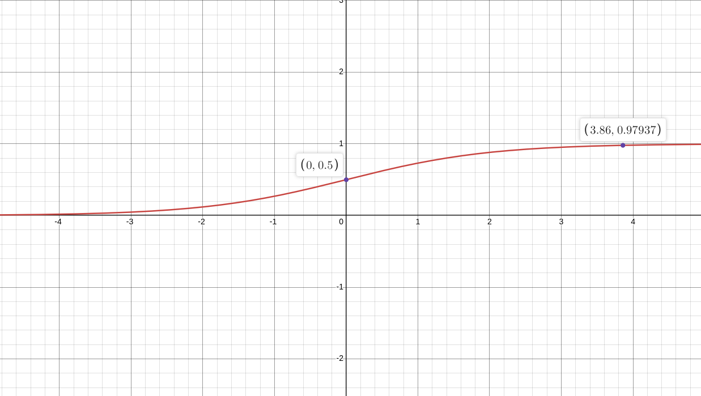
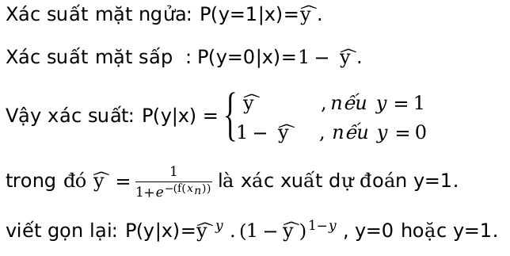
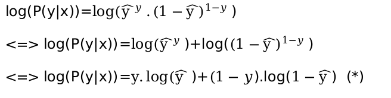
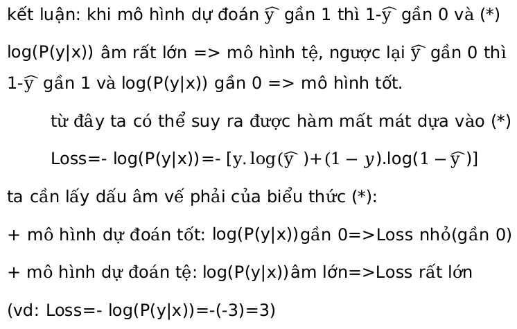
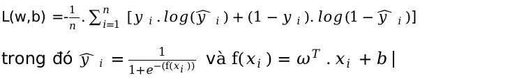
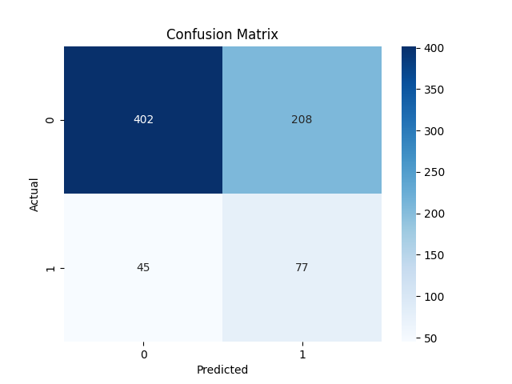
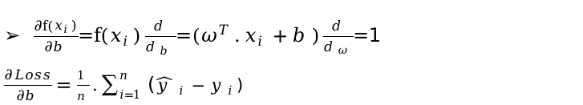

 <h1 align="center">Logistic Regression</h1>

## Giới thiệu

  Hồi quy logistic là một thuật toán học máy có giám sát được sử dụng cho
các vấn đề phân loại. Không giống như hồi quy tuyến tính dự đoán các giá
trị liên tục, nó dự đoán xác suất đầu vào thuộc về một lớp cụ thể. Nó
được sử dụng để phân loại nhị phân, trong đó đầu ra có thể là một trong
hai loại có thể có như Có/ Không, Đúng/ Sai hoặc 0/ 1. Nó sử dụng hàm
sigmoid để chuyển đổi đầu vào thành giá trị xác suất giữa 0 và 1. Hãy
xem những điều cơ bản về hồi quy logistic và các khái niệm cốt lõi của
nó.

## Cách hoạt động

ví dụ: Hãy xem xét vấn đề phát hiện xem một người có bị bệnh tim hay
không bị bệnh tim.

  

Đầu vào có thể biểu diễn như vector
$x = [x_0, x_1, x_2, \ldots, x_n]$, với mỗi thành phần $x_{i}$
tương ứng với một đặc trưng trong một mẫu bệnh án.

:white_check_mark: Để có mô hình đáp ứng được điều này ta thử quay lại bài toán hồi quy
tuyến tính $f(x_{n}) = \omega_{n}^{T}.x_{n} + b_{n}$.

  

$$f(x_{n}) = 29.79,\  \in R\ $$

vậy làm cách nào để kết quả đầu ra có giá trị rời rạc?

## Giải pháp

:white_check_mark: Giải pháp cho vấn đề trên ta có hàm Sigmoid đây là một giải pháp để tạo
ra giá trị rời rạc, xem đồ thị của hàm Sigmoid.
$\widehat{y\ } = g(f(x_{n})) = \frac{1}{1 + e^{- (f(x_{n}))}},\widehat{y\ },g(f(x_{n})) \in \lbrack 0,1\rbrack$

  

➡️ Xét một ví dụ xác suất thống kê cho việc tung đồng xu. Tung đồng xu 5
lần được 3 lần mặt ngửa (đặt là 1) và 2 lần mặt sấp (đặt là 0).

  

✅ Để dễ tính ta lấy log hai vế.

  

🎯 Mục tiêu của bài toán

Mục tiêu là tối đa hóa khả năng mô hình dự đoán đúng nhãn thực tế.

- Nếu nhãn thực tế là $y = 1$ và dự đoán $\widehat{y} = 0.999$ → ✅ **dự đoán tốt**
- Nếu nhãn thực tế là $y = 1$ nhưng dự đoán $\widehat{y} = 0.001$ → ❌ **dự đoán kém**

> Giờ hãy xem ý nghĩa thực tế của biểu thức (*).
> 
> Nếu `y = 1`, thì (*) tương đương với:  
> $$\log(P(y|x)) = \log(\hat{y})$$

| y (thực tế) | $$\hat{y}$$ (dự đoán) | $$\log(\hat{y})$$ | Ý nghĩa                           |
|-------------|------------------------|-------------------|-----------------------------------|
| 1           | 0.999                  | -0.0004345        | Tốt       |
| 1           | 0.9                    | -0.0457574        | Khá tốt                           |
| 1           | 0.4                    | -0.39794          | Không tốt                         |
| 1           | 0.001                  | -3                | Tệ                                |

✅ Kết luận

Khi mô hình dự đoán $\widehat{y}$ gần 1:
$$\log(P(y|x))$$ gần 0 ⟹ mô hình dự đoán tốt ✅

Ngược lại, khi $$\hat{y}$$ gần 0:
log(P(y|x)) trở thành một số âm rất lớn ⟹ mô hình dự đoán tệ ❌

> Nếu `y = 0`, thì (*) tương đương với:  
> $$\log(1 - \hat{y})$$

| y (thực tế) | $$\hat{y}$$ (dự đoán) | $$\log(1 - \hat{y})$$ | Ý nghĩa                              |
|-------------|------------------------|------------------------|--------------------------------------|
| 0           | 0.999                  | -3                     | Tệ                                   |
| 0           | 0.9                    | -1                     | Không tốt                             |
| 0           | 0.4                    | -0.221848              | Trung bình                            |
| 0           | 0.001                  | -0.0004345             | Tốt            |

  

Vậy tiếp theo ta cần phải làm gì khi đã có được hàm Loss.

➡️Để có được mô hình dự đoán tốt thì ta cần cực tiểu hoá hàm Loss

## Thuật toán

Trong tập huấn luyện có n mẫu.

  

➡️ đạo hàm riêng Loss với w.

  

➡️ đạo hàm riêng Loss với b.

  

## Kiểm thử

  

  

<em>chạy thử thuật toán</em>

Nhận thấy accuracy của mô hình khá cao tuy nhiên mục tiêu dự đoán những người bị bệnh thật sự rất kém Recall= 7%

❌ thấy rằng Model accuracy: 0.837 dễ nhầm lẫn thành model dự đoán tốt tuy nhiên Recall= 0.066 lại rất thấp

❌dẫn đến việc dự đoán người thực sự mắc bệnh thì model dự đoán lại rất tệ nhìn vào confusion_matrix có đến 122 người thực sự mắc bệnh mà chỉ dự đoán được 8 người

**Nguyên nhân**

do bộ dữ liệu bị mát cân bằng giữa class bị bệnh (y=1) và class không bị bệnh (y=0), nên mô hình tập trung vào học các đặc trưng của các samples không bị bệnh (y=0).

**Giải pháp**

có 2 cách điển hình.

✅ cách 1: Cân bằng dữ liệu huấn luyện nhân bản dữ liệu những class bị bệnh để model có thể học được nhiều hơn về class bị bệnh.

✅ kết quả:

Before SMOTE:

Number of samples in each class: Counter({0: 2489, 1: 435})

After SMOTE:

Number of samples in each class: Counter({0: 2489, 1: 2489})

✅ cách 2: Ta sẽ cần tìm điểm cân bằng sao cho model có thể dự đoán được nhiều người bị bệnh thật sự nhưng cũng không được cảnh báo nhầm nhiều người từ không bị bệnh thành bị bệnh. bằng cách tìm điểm ngưỡng để cân bằng F1_score. tuy nhiên nếu muốn model không bỏ sót người bị bệnh thực sự thì ta lại phải đánh đổi việc model cảnh báo nhầm những người không bị bệnh nhưng lại được dự đoán là bị bệnh.

**Tìm điểm tối ưu.**

  

<em>Điểm tối ưu cho F1 và Recall</em>

Cho mô hình thay đổi ngưỡng từ 0.1 đến 0.9 để tìm ngưỡng tối ưu cho 2
metrics F1 score và Recall.

✅ kết quả: khi áp dụng cả cách 1 và 2 ta tìm được điểm ngưỡng tốt nhất
như sau.

Threshold best F1-score: 0.46 with F1 = 0.378

Threshold best Recall: 0.32 with Recall = 0.795

**Tinh chỉnh**

Điều chỉnh tham số mô hình cụ thể là 2 ngưỡng mới tìm được ở trên để xem
xét mô hình

<table align="center">
  <tr>
    <td align="center" width="45%">
       
      <em>Best F1</em>
    </td>
    <td align="center" width="45%">
       
      <em>Best Recall</em>
    </td>
  </tr>
</table>

<table align="center">
  <tr>
    <td align="center" width="45%">
       
      <em>Best F1 confusion matrix</em>
    </td>
    <td align="center" width="45%">
       
      <em> Best Recall confusion matrix</em>
    </td>
  </tr>
</table>

